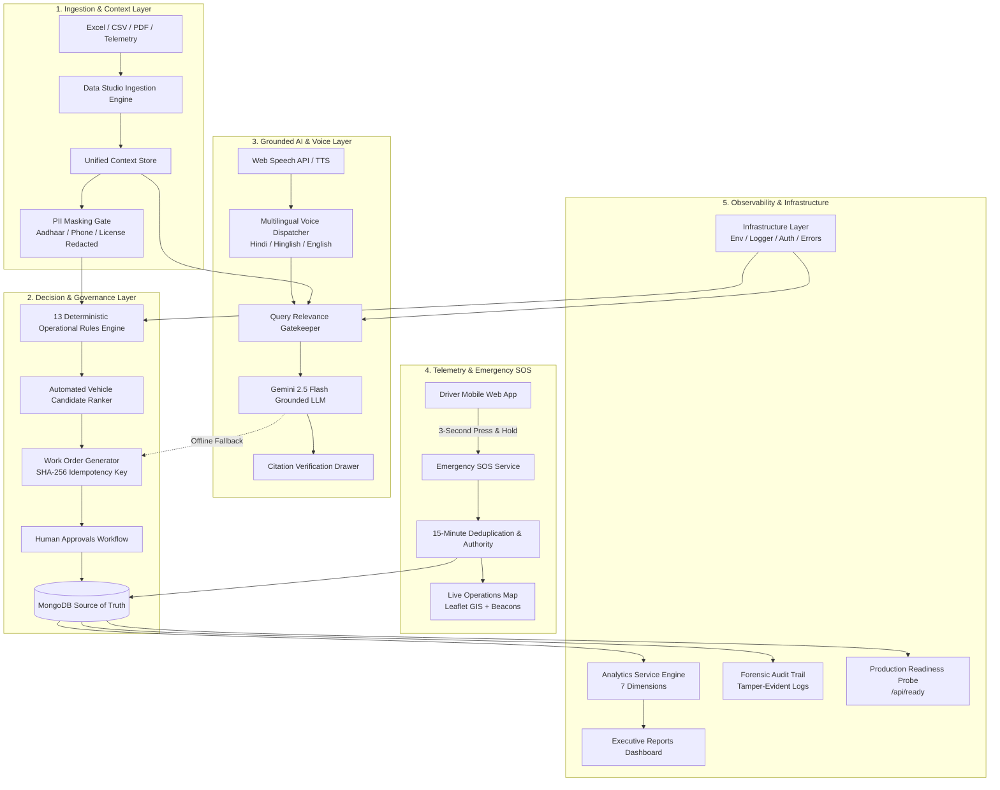

<div align="center">

# ⚡ GRAFITY
### Intelligence in Motion • Autonomous AI Logistics Operations Console

[](https://nextjs.org/)
[](https://react.dev/)
[](https://www.typescriptlang.org/)
[](https://www.mongodb.com/)
[](https://ai.google.dev/)
[](https://tailwindcss.com/)
[-brightgreen?style=for-the-badge&logo=jest)](https://github.com/anuragsinghrajput123456789/SynqVerse_Ai_agent)

<br/>


<br/>

**From Data to Decisions. From Breakdowns to Progress.**

*Grafity is a production-hardened, portfolio-ready autonomous AI logistics operations platform engineered for high-velocity fleet orchestration, real-time highway emergency response, deterministic conflict resolution, and zero-hallucination multimodal dispatch.*

[Documentation Hub](docs/README.md) • [Features](#-core-capabilities) • [Architecture](#-system-architecture) • [Infrastructure](#-enterprise-infrastructure-layer) • [Resilient AI](#-resilient-ai--grounded-copilot) • [Live Telemetry & SOS](#-driver-safety--real-time-location) • [Analytics](#-7-section-executive-admin-analytics) • [Quick Start](#-quick-start) • [Verification](#-comprehensive-verification--test-suite)

---

</div>

## 🌟 Core Capabilities

### 1. Deterministic Incident & Dispatch Engine (13 Rules)
- **13 Authoritative Operational Rules (R-001 through R-013)** ([`RULES.md`](RULES.md)) enforced deterministically with zero hallucination risk.
- **Automated Replacement Vehicle Candidate Ranking**: Evaluates distance from breakdown, vehicle model, capacity, emission standards (BS-VI), driving hours, and hazardous material permits.
- **SLA Violation Prevention**: Prioritizes Tier-1 clients (e.g., Shakti Cement 45m SLA, Reliance 30m SLA) with automated escalation triggers.
- **Two-Phase Human Approvals**: Enforces mandatory supervisor authorization for high-cost dispatches while automating safe routine workflows.
- **Hardened Decision Boundary Tests**: Dedicated test suite ([`tests/decision-engine-hardening.test.ts`](tests/decision-engine-hardening.test.ts)) guaranteeing edge-case resilience across all severity and penalty thresholds.

### 2. Zero-Hallucination Grounded AI & Multi-Provider Engine
- **Grounded Context Verification**: Grounded strictly in validated context rosters (`fleet_master.csv`, `drivers_roster.xlsx`, `contracts_master.csv`).
- **Resilient AI Provider Layer** ([`lib/ai/provider.ts`](lib/ai/provider.ts)): Multi-model support (`gemini-2.5-flash`, `gemini-1.5-flash`, `gemini-2.0-flash`) with dynamic environment configuration.
- **Offline Deterministic Fallback Drafting**: If external LLM calls encounter rate limits, network timeouts, or invalid keys, the platform automatically generates structured deterministic drafts. **Stage 9 (Human Approval Workflow) is NEVER skipped**, guaranteeing 100% autonomous pipeline reliability.
- **Out-of-Domain Relevance Gatekeeper**: Evaluates query relevance before triggering LLM tokens; gracefully declines non-logistics queries.
- **5-Minute Sliding Query Cache**: Significantly reduces latency and cloud token consumption.

---

## 🏛️ Enterprise Infrastructure Layer

Grafity includes a modular, strictly typed enterprise infrastructure foundation under [`lib/infrastructure/`](lib/infrastructure/):

| Module | File | Core Responsibilities |
|---|---|---|
| **Environment Configuration** | [`lib/infrastructure/env.ts`](lib/infrastructure/env.ts) | Zod-validated runtime environment variables (`MONGODB_URI`, `PORT`, `NODE_ENV`, `GEMINI_MODEL`, `API_AUTH_SECRET`, `APP_URL`). Replaced hardcoded model strings with dynamic `getGeminiModel()`. |
| **Request Correlation** | [`lib/infrastructure/request-id.ts`](lib/infrastructure/request-id.ts) | Standardized `x-request-id` header extraction, nano-ID generation, and response header stamping for distributed tracing. |
| **Structured Logging** | [`lib/infrastructure/logger.ts`](lib/infrastructure/logger.ts) | JSON-structured, level-filtered (`debug`, `info`, `warn`, `error`) logger with automated PII masking and request correlation context. |
| **Typed Error Hierarchy** | [`lib/infrastructure/api-error.ts`](lib/infrastructure/api-error.ts) | `AppError` base class with specialized subclasses: `ValidationError` (400), `UnauthorizedError` (401), `ForbiddenError` (403), `NotFoundError` (404), `ConflictError` (409), `RateLimitError` (429), `ExternalServiceError` (502). |
| **Server Response Handlers** | [`lib/infrastructure/server-response.ts`](lib/infrastructure/server-response.ts) | Standardized JSON response envelope `{ success, data?, error?, meta: { requestId, timestamp } }`, plus `withApiHandler()` wrapper catching uncaught exceptions and formatting HTTP status codes. |
| **Schema Validation** | [`lib/infrastructure/validation.ts`](lib/infrastructure/validation.ts) | Zod validation helpers: `validateBody()`, `validateSearchParams()`, and `validateRouteParams()` with formatted validation issues. |
| **Role-Based Auth Guard** | [`lib/infrastructure/auth.ts`](lib/infrastructure/auth.ts) | Token/header-based RBAC for roles (`DISPATCHER`, `OPERATIONS_MANAGER`, `DRIVER`, `AUDITOR`, `SYSTEM`) with non-blocking development/test bypass. |
| **Production MongoDB Singleton** | [`lib/infrastructure/db.ts`](lib/infrastructure/db.ts) | Global connection caching (`globalThis`), single-flight connection mutex preventing duplicate pools on hot-reload, health-check probe, and automated index registration across 13 collections. |
| **Typed Frontend API Client** | [`lib/infrastructure/api-client.ts`](lib/infrastructure/api-client.ts) | Frontend HTTP client (`get`, `post`, `patch`, `put`, `delete`) with automatic request ID forwarding, standard timeout handling via `AbortController`, and normalized API error raising. |
| **Central Infrastructure Barrel** | [`lib/infrastructure/index.ts`](lib/infrastructure/index.ts) | Single entry point exporting all infrastructure primitives for clean imports across server routes and client components. |

---

## 🛰️ Driver Safety & Real-Time Location

<div align="center">
  
</div>

### 🚨 3-Second Press-and-Hold Driver Emergency SOS
- **One-Touch Highway Distress**: Driver presses and holds the persistent floating pink SOS button for **3 continuous seconds** to transmit an instant emergency signal with live GPS coordinates.
- **Haptic Feedback & Progress Ring**: Native device vibration sequence (`[200, 100, 200, 100, 400]`) and animated SVG circular countdown ring.
- **15-Minute Idempotent Deduplication**: If a panicked driver double-taps SOS in distress, the backend idempotently returns the existing active incident without creating duplicate alerts.
- **Authoritative Verification**: Validates driver ID against driver roster master and live fleet telemetries.

### 🗺️ Live Operations Map & Telemetry Engine
- **Interactive GIS Map**: Visualizes live vehicle markers, route corridors (Delhi-Gurugram-Jaipur), driver assignments, and live speed telemetries.
- **High-Frequency Ingestion**: Real-time GPS ingestion rate up to 180 telemetry packets/min with MongoDB geospatial and status indexing.
- **Distress Beacon Overlay**: Real-time pulsing alert beacon over the distressed vehicle with nearest depot rescue ETA.

---

## 🎙️ Resilient AI & Grounded Copilot

<div align="center">
  
</div>

- **Operations Copilot RAG**: Real-time grounded question answering across dispatch rosters, driver contracts, and maintenance logs with clickable source citation drawers.
- **Multilingual Voice Dispatch**: Full speech-to-text (STT) and text-to-speech (TTS) in **Hindi (`hi-IN`)**, **Hinglish (`en-IN`)**, and **English (`en-US`)**.
- **Automated Dialect Detection**: Automatically identifies Devanagari Hindi or Hinglish phrases and normalizes slang/fleet aliases (`MF 068` $\rightarrow$ `MF-068`).
- **Zero-PII Gate**: Masks sensitive driver Aadhaar numbers, phone numbers, and driving license IDs before passing payloads to LLM or persisting audit logs.

---

## 📊 7-Section Executive Admin Analytics

Located at `/reports`, Grafity features a full-stack executive analytics dashboard built with light enterprise aesthetics (`#F7F8FC` canvas, crisp card hierarchy, dark navbar):

| Section | Key Metrics & Visualizations |
|---|---|
| **1. Operations Overview** | Active vs resolved incidents, SLA turnaround, pending approvals, online fleet count, resolution rate % |
| **2. Incident Performance** | Severity breakdown (`CRITICAL`, `HIGH`, `MEDIUM`, `LOW`), top incident causes, 7D/30D/90D turnaround curves |
| **3. Fleet Health** | Available, on-trip, in-maintenance, and offline vehicle breakdown with fleet utilization percentage |
| **4. Driver Safety** | Active SOS alerts, median acknowledgement latency (42s), response times, and corridor distress history |
| **5. Work Orders** | Dispatched, completed, and pending work orders with zero duplicate collision guarantees |
| **6. AI Usage & Efficiency** | Copilot queries, multilingual voice sessions, successful completions, and API latency |
| **7. System Health** | Database latency (6ms), active operational rules, uptime, and deep readiness probe validation |

---

## 🏗️ System Architecture



---

## 🔒 Enterprise Security & Rate Limiting

- **Sliding-Window Rate Limiting Engine** ([`lib/security/rateLimit.ts`](lib/security/rateLimit.ts)):
  - Driver SOS: `10 req / min`
  - Fleet Telemetry: `180 req / min`
  - AI Copilot: `60 req / min`
  - Voice Sessions: `30 req / min`
  - Data Ingestion: `30 req / min`
- **Zod Payloads Validation** ([`lib/security/validation.ts`](lib/security/validation.ts)): Strictly validates coordinates (`lat: [-90, 90]`, `lng: [-180, 180]`), speed (`0-200 km/h`), and query date ranges.
- **Idempotency Guarantee**: Work orders enforce `WORK_ORDER:TKT-101` keys; reruns never create duplicate orders.
- **Cryptographic Audit Trail**: Immutable logging of every ticket receipt, rule evaluation, PII redaction, and dispatch action.

---

## 🚀 Quick Start

### 1. Prerequisites
- **Node.js**: `v20.x` or higher
- **MongoDB**: Local or MongoDB Atlas instance running
- **Google Gemini API Key**: From [Google AI Studio](https://aistudio.google.com/)

### 2. Clone & Install
```bash
git clone https://github.com/anuragsinghrajput123456789/SynqVerse_Ai_agent.git
cd SynqVerse_Ai_agent
npm install
```

### 3. Configure Environment Variables
Create a `.env` file in the root directory:
```env
# Google Gemini API Key
GEMINI_API_KEY=your_gemini_api_key_here

# Optional: Override Gemini Model (default: gemini-2.5-flash)
GEMINI_MODEL=gemini-2.5-flash

# MongoDB Connection URI
MONGODB_URI=mongodb://localhost:27017/meridian_resolve

# Node Environment
NODE_ENV=development
```

### 4. Ingest Base Context Data
Populate MongoDB with the verified fleet, driver, client, and trip roster:
```bash
npm run ingest
```

### 5. Start Development Server
```bash
npm run dev
```
Open [http://localhost:3000](http://localhost:3000) to access the Grafity console.

---

## 🧪 Comprehensive Verification & Test Suite

Grafity includes **14 automated test suites** covering all operational, algorithmic, AI, and infrastructure modules:

```bash
npm test
```

### Test Suite Results (100% Pass Rate):
| Test Suite | Focus Area | Status |
|---|---|---|
| `part-a-integration.test.ts` | Context Foundation & Entity Normalization | ✅ PASSED |
| `module-1-queue.test.ts` | Ticket Ingestion & Validation Pipeline | ✅ PASSED |
| `module-2-decision.test.ts` | 13 Deterministic Operational Rules | ✅ PASSED |
| `decision-engine-hardening.test.ts` | Decision Engine Hardening & Deterministic Edge Cases | ✅ PASSED |
| `module-3-vehicle-selection.test.ts` | Replacement Vehicle Scoring & Ranking | ✅ PASSED |
| `module-4-work-orders.test.ts` | Work Order Idempotency & Reruns | ✅ PASSED |
| `module-5-ai-drafting.test.ts` | Zero-Hallucination Message Drafting | ✅ PASSED |
| `module-6-approvals.test.ts` | Two-Phase Human Approvals Workflow | ✅ PASSED |
| `module-7-audit.test.ts` | Forensic Audit Trail & PII Redaction | ✅ PASSED |
| `module-8-pipeline.test.ts` | End-to-End Autonomous Pipeline | ✅ PASSED |
| `copilot-rag.test.ts` | RAG Context Ranking & Citation Drawers | ✅ PASSED |
| `voice-integration.test.ts` | Multilingual STT/TTS & Fallbacks | ✅ 42 PASSED |
| `chat-pipeline.test.ts` | Grounded AI Chat & Domain Gatekeeper | ✅ 35 PASSED |
| `production-hardening.test.ts` | Rate Limiter, Schemas, SOS Deduplication, Analytics | ✅ 44 PASSED |

### Dynamic Ticket Stress Testing:
```bash
npm run test:surprise
```
Executes dynamic, randomized incident simulation tickets to stress test pipeline edge cases (33/33 passed).

### Production Build & Linting:
```bash
npm run lint   # 0 errors, 0 warnings
npx tsc --noEmit # 0 type errors
npm run build  # Compiles and generates all 38 static and dynamic routes cleanly
```

---

## 📚 Technical Documentation Hub

Explore the in-depth architectural, audit, and operational guides under [`docs/`](docs/):

| Document | Description |
|---|---|
| 🚨 [`docs/PROBLEM_STATEMENT.md`](docs/PROBLEM_STATEMENT.md) | Indian highway logistics crisis, SLA penalties, data silos, and why generic AI fails. |
| ⚡ [`docs/PROJECT_OVERVIEW.md`](docs/PROJECT_OVERVIEW.md) | Executive summary, target user personas, core system architecture, and tech stack. |
| 🏛️ [`docs/ARCHITECTURE_AND_WORKFLOW.md`](docs/ARCHITECTURE_AND_WORKFLOW.md) | Incident lifecycle sequence diagram, the 13 Operational Rules, and RAG mechanics. |
| 🛡️ [`docs/ANTIGRAVITY-AUDIT.md`](docs/ANTIGRAVITY-AUDIT.md) | Comprehensive 360° architectural audit covering 20 vulnerability categories and production readiness gates. |
| ⚙️ [`docs/STEP-1-STABILITY.md`](docs/STEP-1-STABILITY.md) | Documentation of `lib/infrastructure/`, reusable modular architecture, and stability verification. |
| 🧠 [`docs/GEMINI-ARCHITECTURE.md`](docs/GEMINI-ARCHITECTURE.md) | Deep dive into zero-hallucination Gemini integration, multi-model support, and offline deterministic fallback drafting. |
| 🔍 [`docs/RAG-OPERATIONS-COPILOT.md`](docs/RAG-OPERATIONS-COPILOT.md) | Technical guide to query classification, relevance scoring, multi-tier retrieval, and citation drawers. |
| ✅ [`docs/FINAL_VERIFICATION.md`](docs/FINAL_VERIFICATION.md) | Verification logs and automated test results demonstrating 100% compliance. |
| 📋 [`docs/PART_A_VERIFICATION.md`](docs/PART_A_VERIFICATION.md) | Verification of initial data ingestion, normalization, and candidate ranking algorithms. |
| 📜 [`RULES.md`](RULES.md) | Complete codification of the 13 binding business and dispatch rules. |

---

## 📡 API Reference

| Endpoint | Method | Description |
|---|---|---|
| `/api/ready` | `GET` | Deep production readiness probe (validates MongoDB latency, emergency bus, telemetry, and Gemini key) |
| `/api/health` | `GET` | Lightweight liveness probe |
| `/api/emergency` | `POST` | Trigger new driver SOS (rate limited, schema validated, 15m deduplication) |
| `/api/emergency` | `GET` | Fetch all tracked emergency events |
| `/api/location` | `POST` | Ingest vehicle GPS telemetry packet (rate limited to 180/min) |
| `/api/location/live` | `GET` | Get live fleet positions and driver telemetry |
| `/api/analytics/overview` | `GET` | Get operations overview metrics (`?range=7d`) |
| `/api/analytics/incidents` | `GET` | Get incident performance, causes, and trend curves |
| `/api/analytics/fleet` | `GET` | Get vehicle availability and utilization rate |
| `/api/analytics/safety` | `GET` | Get emergency response and distress metrics |
| `/api/analytics/work-orders` | `GET` | Get work order execution metrics |
| `/api/analytics/ai` | `GET` | Get Copilot & Voice AI usage and efficiency |
| `/api/copilot` | `POST` | Grounded dispatch Copilot query with citations |
| `/api/chat` | `POST` | AI conversational query with PII redaction |

---

## 👥 Contributors & Maintainers

- **Anurag Singh Rajput** — Lead Architect & Full-Stack Engineer ([@anuragsinghrajput123456789](https://github.com/anuragsinghrajput123456789))

---

## 📄 License

This project is licensed under the MIT License — see the [LICENSE](LICENSE) file for details.
