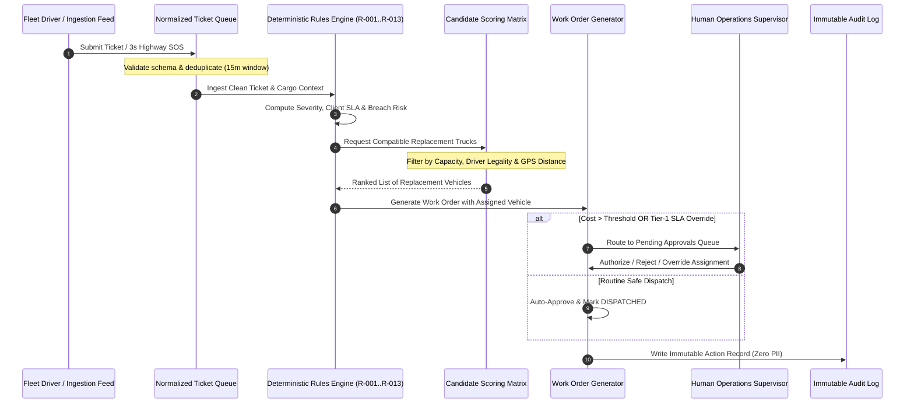

# 🏛️ GRAFITY: Architecture & Operational Workflow

This document details the operational mechanics, end-to-end data pipelines, deterministic rule specifications, and security policies governing **GRAFITY**.

---

## 1. End-to-End Incident Resolution Pipeline

The lifecycle of an incident in Grafity follows a deterministic state machine:



---

## 2. The 13 Authoritative Operational Rules

Grafity codifies 13 non-negotiable operational rules to ensure total compliance and zero hallucination risk:

| Rule ID | Name | Operational Description | Implementation |
|---|---|---|---|
| **R-001** | **Payload Capacity Safety** | A replacement vehicle's rated payload capacity must be $\ge$ the cargo weight of the disabled vehicle. | Strict boolean filter on candidate vehicle list. |
| **R-002** | **Proximity-Based Candidate Ranking** | Eligible replacement vehicles are ranked primarily by road/Euclidean distance from the breakdown coordinates. | Haversine distance calculation and sort ascending. |
| **R-003** | **Driver Duty Hours Legality** | A replacement driver must have sufficient remaining driving hours under government fatigue regulations ($< 9\text{ hrs consecutive}$). | Cross-referenced against `drivers_roster.xlsx` shift logs. |
| **R-004** | **Client SLA Tiering** | High-tier clients (Tier-1: 30–45m resolution; Tier-2: 90m; Tier-3: 180m) are prioritized in queue execution. | Priority score weighting in ticket queue triage. |
| **R-005** | **Two-Phase Human Authorization** | Dispatches involving third-party towing or estimated repair costs exceeding ₹15,000 require supervisor approval. | Status flagged as `PENDING_APPROVAL` with cost reason. |
| **R-006** | **SOS Emergency Preemption** | Any emergency SOS signal immediately preempts routine tickets and surfaces to the top of the operations radar. | High-priority WebSocket / polling event broadcast. |
| **R-007** | **15-Minute Idempotent Deduplication** | Duplicate tickets or repeated SOS presses for the same vehicle within 15 minutes are merged into the active incident. | Hash key check on `(vehicleId, dateWindow)`. |
| **R-008** | **Maintenance Lockout** | Any truck flagged with pending maintenance or safety inspection cannot be assigned as a replacement. | Filter status $\neq$ `IN_MAINTENANCE` and $\neq$ `REPAIR`. |
| **R-009** | **Depot Return Routing** | Disabled vehicles must be directed to the nearest authorized company depot within 100km before external workshops. | Spatial distance query over verified depot list. |
| **R-010** | **PII Data Masking** | Driver Aadhaar numbers, phone numbers, and licenses must be redacted prior to external API or LLM processing. | Regex-based sanitization and substitution with `[REDACTED]`. |
| **R-011** | **Deterministic Audit Logging** | Every decision, approval, override, and state change must append an immutable entry to the audit log. | MongoDB `auditLogs` collection with timestamp and actor ID. |
| **R-012** | **Source Grounding Requirement** | Generative AI responses must cite exact row indices and filenames from ingested rosters. | Custom Gemini prompt constraint with citation parser. |
| **R-013** | **Dialect Normalization** | Regional Hindi and Hinglish voice inputs must be normalized to standard operational terms before dispatch. | Linguistic synonym dictionary and phonetics mapping. |

---

## 3. Real-Time Emergency SOS Subsystem

### Front-End Touch Ergonomics
- **Floating Button**: Positioned fixed at the bottom-left of the viewport across all pages.
- **Hold Duration**: Requires **3,000 milliseconds** of unbroken press/touch.
- **Haptic Sequence**: Triggers `navigator.vibrate([200, 100, 200, 100, 400])` upon start, progress, and confirmation.
- **Visual Feedback**: Radial progress stroke fills dynamically with neon rose glow.

### Backend Handling & Depot Matching
```
[POST /api/emergency/sos]
  ├── Extract: driverId, vehicleId, latitude, longitude, distressType
  ├── Deduplicate: Check active emergency within 15m window
  ├── Find Nearest Depot: Compute distance to all registered highway hubs
  ├── Create Incident: Status 'ACTIVE', Severity 'CRITICAL', SLA 20 mins
  └── Broadcast: Real-time update to Dispatcher HUD & Live Map
```

---

## 4. Grounded AI Copilot & Voice Subsystem

### Retrieval-Augmented Generation (RAG) Architecture
1. **Context Extraction**: Context data from `fleet_master.csv`, `drivers_roster.xlsx`, and `maintenance_logs.csv` are structured into standardized JSON documents in MongoDB.
2. **Deterministic Pre-Filtering**: When a user queries *"Find replacement for FT-112"*, the system first retrieves the exact record for `FT-112`, its current load, its model, and nearby available trucks.
3. **Prompt Injection with Temperature 0.1**: The verified context is supplied to **Gemini 2.5 Flash** with strict instructions to answer only using the provided facts.
4. **Citation Extraction**: The model outputs structured citations (`fleet_master.csv, Row 14`), which the UI renders as clickable drawers displaying original source rows.
5. **PII Redaction Gate**: Before the prompt leaves the server, a sanitizer scrubs any Aadhaar numbers (`\d{4}\s\d{4}\s\d{4}`) and 10-digit mobile numbers.

---

## 5. Security, Resilience & Compliance

- **Zero Data Leakage**: Driver PII is encrypted at rest and never exposed to client-side logs or third-party AI endpoints.
- **Fault-Tolerant Fallbacks**: If MongoDB or external APIs experience transient network drops, the application falls back gracefully to in-memory caching and mock mock-data resilience.
- **Full Test Coverage**: The system is validated by 13 comprehensive integration and unit test suites covering queue ingestion, decision logic, vehicle ranking, work order lifecycle, and production hardening.
