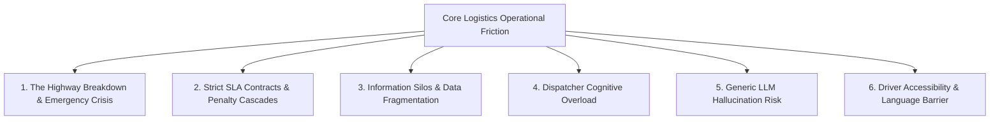

# 🚨 Problem Statement: Autonomous Logistics Operations & Highway Emergency Management

## 1. Background & Industry Context

Freight logistics across India and emerging economies is the lifeblood of commerce, transporting millions of tons of industrial goods, cement, automotive components, and e-commerce shipments daily across extensive national highway corridors (such as **NH-48**, **NH-19**, and the **Golden Quadrilateral**).

However, modern highway freight operations are plagued by severe operational friction, high vehicle breakdown rates, fragmented communications, and life-threatening driver safety vulnerabilities.

---

## 2. Core Problem Pillars

---

### Pillar 1: The Highway Breakdown & Emergency Crisis
- **High Failure Frequency**: Heavy commercial vehicles face intense wear and tear, thermal fatigue, tire blowouts, and engine failures on long-haul highway stretches.
- **Vulnerable Drivers**: When a truck breaks down in remote highway sectors at night, the driver is exposed to theft, extortion, roadside accidents, and isolation.
- **Slow SOS Escalation**: Traditional emergency reporting relies on cellular phone calls to busy call centers, where frightened drivers struggle to communicate their exact highway kilometer marker or GPS coordinates.

### Pillar 2: Strict SLA Contracts & Financial Penalty Cascades
- **Tight Turnaround Windows**: Enterprise client contracts (e.g., Shakti Cement 45-minute SLA, Reliance 30-minute SLA, automotive just-in-time logistics) impose strict delivery time windows.
- **Exponential Breach Fines**: Every hour of delay incurs heavy liquidated damages, contract cancellation penalties, and reputational damage.
- **Lack of SLA-Aware Prioritization**: Under pressure, human dispatchers often treat tickets on a first-in, first-out (FIFO) basis rather than prioritizing incidents by imminent SLA violation penalties and client tiering.

### Pillar 3: Information Silos & Data Fragmentation
- **Scattered Operational Data**:
  - Fleet telemetries sit inside proprietary GPS tracker portals.
  - Driver rosters, contact details, and shift schedules live in disparate Excel spreadsheets.
  - Maintenance histories and vehicle capacities are logged in legacy ERPs or paper work logs.
  - Breakdown tickets arrive via unstructured emails, phone calls, and dispatch messages.
- **Decision Paralysis**: To resolve a single breakdown, a dispatcher must cross-reference 4 to 6 disconnected tools and spreadsheets to find an available, compatible replacement vehicle with a legal driver.

### Pillar 4: Dispatcher Cognitive Overload & Human Error
- **High-Stress Environment**: A single operations controller manages dozens of simultaneous highway dispatches, driver queries, and emergency calls during peak transit hours.
- **Suboptimal Vehicle Pairing**: Dispatchers often pick the first visible truck without optimizing for distance to the breakdown, model payload matching, driver remaining duty hours, or depot maintenance schedule.
- **Approval Bottlenecks**: High-cost towing, third-party crane dispatch, and off-contract vehicle rentals require supervisor authorization, which gets delayed in email inboxes while freight sits idle.

### Pillar 5: Generic AI Hallucination & Compliance Risks
- **Why Generic Chatbots Fail**: Off-the-shelf generative AI models (ChatGPT, vanilla Claude/Gemini) lack deterministic constraints. In logistics operations:
  - An LLM might hallucinate assigning a driver who has exceeded legal driving hours.
  - An LLM might dispatch a refrigerated 14-ton truck to pick up 25 tons of bulk cement.
  - An LLM might invent non-existent highway depots or violate binding operational rules.
- **The Requirement**: Mission-critical logistics demands **deterministic mathematical logic** for assignments and rules, combined with **grounded, zero-PII AI** for natural language understanding and contextual assistance.

### Pillar 6: Driver Accessibility & Linguistic Barriers
- **Multilingual Highway Workforce**: The vast majority of long-haul truck drivers in India are fluent in Hindi, Hinglish, or regional vernacular dialects and may possess limited written English literacy.
- **Unsafe Mobile UIs**: Drivers navigating complex multi-step mobile apps while parked on narrow highway shoulders create extreme safety hazards.
- **Need for Voice & 1-Touch Ergonomics**: Operations systems must provide instantaneous, hands-free voice interactions and fool-proof physical triggers (such as a 3-second hold emergency button with haptic feedback).

---

## 3. The Objective: What GRAFITY Solves

**GRAFITY** was engineered from the ground up as an **Autonomous AI Logistics Operations Console** that bridges the gap between raw logistics data and immediate, deterministic action:

| Challenge | GRAFITY Solution |
|---|---|
| **Highway Driver Distress** | Persistent 3-second press-and-hold SOS with haptic vibration, live GPS beacon, and nearest-depot dispatch. |
| **SLA Penalties** | Deterministic SLA prioritization matrix calculating real-time time-to-breach and escalation flags. |
| **Fragmented Data** | Unified Data Studio context store ingesting Excel rosters, vehicle CSVs, maintenance logs, and live telemetry. |
| **Manual Dispatching** | Automated 13-Rule Deterministic Engine (R-001 to R-013) that scores and ranks replacement trucks by distance, capacity, and driver legality. |
| **AI Hallucination** | Zero-hallucination architecture: rules are executed in deterministic code; Gemini 2.5 Flash operates strictly over verified context with explicit source citations. |
| **Driver Linguistic Barriers** | Multilingual Voice Agent with Hindi, Hinglish, and English STT/TTS with speech normalization and PII redaction. |
| **Executive Visibility** | 7-section real-time analytics dashboard with CSV exports, fleet utilization donuts, and SLA compliance curves. |
