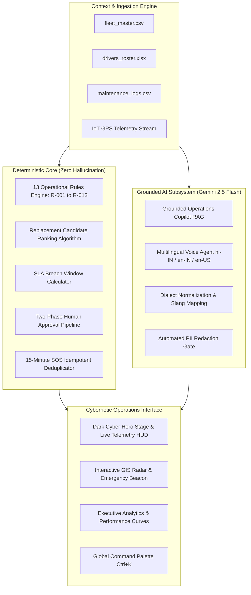

# ⚡ GRAFITY: Project Overview & Technical Specification

> **Intelligence in Motion** • *Autonomous AI Logistics Operations Platform*

---

## 1. Executive Summary

**GRAFITY** is a production-grade, portfolio-ready autonomous AI logistics operations console designed for high-velocity fleet orchestration, real-time highway emergency dispatch, deterministic conflict resolution, and zero-hallucination grounded intelligence.

Engineered to operate across India's high-density freight corridors (such as the Golden Quadrilateral, NH-48, and NH-19), Grafity converts chaotic breakdown feeds, multi-format spreadsheets, driver rosters, and raw IoT GPS pings into optimized, SLA-compliant work orders and rapid emergency rescues.

---

## 2. Target Users & Operational Personas

```
┌───────────────────────────────────────────────────────────────────────────┐
│                          GRAFITY USER ECOSYSTEM                           │
├────────────────────┬────────────────────┬─────────────────────────────────┤
│ Operations Manager │ Highway Dispatcher │ Fleet Driver                    │
│ • Executive KPIs   │ • Ticket triage    │ • 3-second SOS distress         │
│ • SLA enforcement  │ • Approvals review │ • Multilingual voice assistant  │
│ • Audit & reports  │ • Vehicle override │ • Live route & depot guidance   │
└────────────────────┴────────────────────┴─────────────────────────────────┘
```

1. **Operations Manager & Fleet Controller**: Monitors overall fleet readiness, tracks SLA compliance percentages, reviews system health, and exports historical audit analytics.
2. **Highway Emergency Dispatcher**: Receives immediate alerts when an SOS is triggered, reviews automated replacement vehicle candidate suggestions, and authorizes high-cost work orders.
3. **Fleet Driver**: On-the-road driver operating heavy freight trucks who requires foolproof, hands-free emergency assistance and multilingual voice communication in Hindi, Hinglish, or English.
4. **Safety & Audit Officer**: Inspects compliance with the 13 Authoritative Operational Rules, reviews PII redaction compliance, and audits decision logs.

---

## 3. Core System Architecture

Grafity is built upon a **Hybrid Operational Architecture** that divides responsibilities cleanly between mathematical determinism and generative intelligence:



---

## 4. Key Platform Differentiators

### 🛡️ 1. Zero-Hallucination Deterministic Engine
In mission-critical logistics, an AI cannot be allowed to hallucinate driver assignments or invent repair protocols. Grafity enforces **13 Authoritative Operational Rules (R-001 through R-013)** in strict TypeScript code:
- Automatic payload capacity matching ($V_{capacity} \ge Cargo_{weight}$).
- Distance-based ranking of replacement trucks using Euclidean / Haversine road proximity.
- Real-time driver shift legality validation (max consecutive driving hours).
- Automatic supervisor escalation for work orders exceeding financial thresholds.

### 🚨 2. Persistent 3-Second Driver Safety SOS
- Built specifically for vulnerable drivers in remote highway emergencies.
- **Physical Touch Ergonomics**: Requires pressing and holding for 3 continuous seconds with animated SVG countdown and haptic vibration feedback.
- **Idempotency Guarantee**: If a panicked driver taps SOS multiple times within 15 minutes, the system recognizes the active session and returns the existing incident without creating duplicate clutter.
- **Immediate Highway Patrol & Depot Mapping**: Automatically correlates the GPS coordinate with the closest authorized service station.

### 🎙️ 3. Multilingual Grounded Voice AI
- Native speech-to-text and text-to-speech supporting **Hindi (`hi-IN`)**, **Hinglish (`en-IN`)**, and **English (`en-US`)**.
- **Slang Normalization**: Translates common Indian transport jargon (e.g., *"Gaadi breakdown ho gayi Jaipur highway pe"* $\rightarrow$ extracts location `Jaipur Highway`, intent `BREAKDOWN`).
- **PII Redaction Gate**: Automatically redacts Aadhaar numbers, driver mobile numbers, and driving license IDs before passing context to LLMs.

### ⚡ 4. State-of-the-Art Cybernetic Operations UI
- Dark theme designed for high-focus 24/7 command centers (`#040814` canvas, cyber grids, neon cyan and violet HUD elements).
- **Live Telemetry HUD**: Features real-time unit counters, truck telemetry status cards, laser scanline visuals, and animated corridor transit flow across Delhi–Gurugram–Jaipur–Kanpur–Mumbai.

---

## 5. Technology Stack

| Layer | Technologies Used | Rationale |
|---|---|---|
| **Framework** | Next.js 16.3.3 (App Router), React 19.2.8 | Server-side rendering, streaming API routes, fast client transitions. |
| **Language** | TypeScript 5.0 | Type safety across operational rules, telemetry models, and MongoDB schemas. |
| **Styling** | TailwindCSS v4, Vanilla CSS Design System | High-performance cybernetic dark theme, glowing neon tokens, glassmorphism. |
| **Database** | MongoDB 7.6 (Native Node Driver) | Geospatial 2dsphere indexing, rapid telemetry ingestion, flexible ticket documents. |
| **Generative AI** | Google Gemini 2.5 Flash (`@google/genai`) | Low-latency, high-reasoning context grounding with temperature 0.1 for accuracy. |
| **Mapping & GIS** | Leaflet 1.9.4 & OpenStreetMap | Zero-cost, high-performance interactive highway vehicle mapping. |
| **Voice / Speech** | Web Speech API (STT & TTS) | Browser-native, ultra-low latency voice recognition in Hindi and English. |
| **Icons & Visuals** | Lucide React, SVG Micro-animations, Custom 3D Logo | Clean vector iconography and polygonal wireframe brand assets. |
